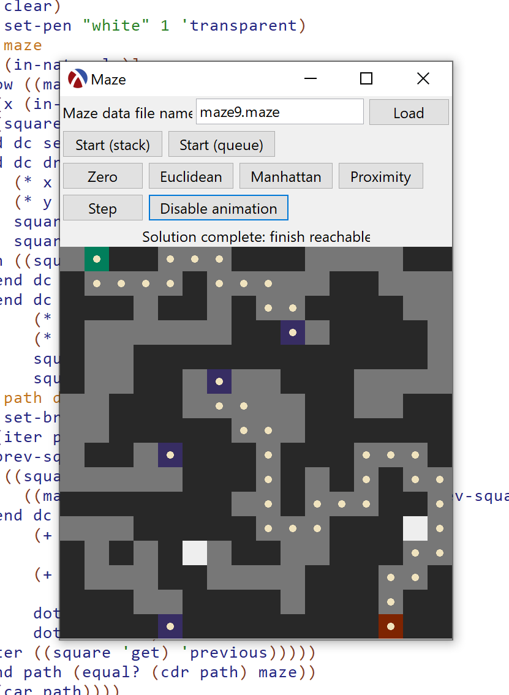

# Scheme is not useless!

An epic program written in Racket (close enough to Scheme, and I'm not 20th century enough to know the difference) that either [makes sure there's a way to get to the end](http://nifty.stanford.edu/2008/blaheta-maze/cs2/index.html) or [actually finds the closest path to it](http://nifty.stanford.edu/2008/blaheta-maze/a-star/index.html).

If you don't know how to run this, download this repository as a .zip, unzip the file, open `main.rkt` in [DrRacket](https://racket-lang.org/), and click the Run button with the green play icon triangle.

## What do they do?

**main.rkt (run this!)** creates the GUI, loads the maze file, renders the maze, and calls the step procedure for the two maze solvers.

**maze-solver.rkt** provides a maze explorer using either a queue or a stack to see if the end can be reached.

**a-star.rkt** provides an implementation of A\* using different heuristic functions.

**queue.rkt** provides a queue object maker where you take out the item least recently added.

**stack.rkt** provides a stack object maker where the most recently added item is taken out.

**point.rkt** provides a point/coordinate/location abstraction.

**square.rkt** provides a square object maker that represents a tile in a maze from a character. Squares hold data such as the type and the g and cached h scores for A\* but do not know their location.

**maze.rkt** provides a maze object maker that parses plain-text maze data. The default square that is returned with `((maze 'get-square) x y)` is a wall if is outside the maze.

**square-num.rkt** provides a single procedure that performs a complex mathematical operation often used in higher mathematics; see the relevant Wikipedia article [here](https://en.wikipedia.org/wiki/Square_(algebra)).

## Maze credits

Mazes 1 and 2 are from http://nifty.stanford.edu/2008/blaheta-maze/cs2/maze-read.txt

I made maze 3 (I am a world-renowned mazeur, I'll have you know.)

Mazes 4, 6, 7, and 8 are from http://nifty.stanford.edu/2008/blaheta-maze/a-star/a-star.txt

Maze 5 from http://nifty.stanford.edu/2008/blaheta-maze/a-star/screenshot.png

Mazes 9, A, and B are from https://github.com/Sordamente/MazeSolver#test-cases-of-note

Mazes C, D, E, and F are from https://github.com/acrantel/grt-maze-solver/tree/master/src

